# Lab: Explore sensitivity labels in Microsoft 365

## Lab scenario
In this lab you will explore the capabilities of sensitivity labels.  You will go through the settings for existing sensitivity labels that have been created and the corresponding policy to publish the label.   Then you will see how to apply a label and the impact of that label, from the perspective of a user.

**Estimated Time**: 20-25 minutes

#### Task 1: In this task you will gain an understanding of what sensitivity labels can do by going through the settings for an existing sensitivity label that have been created and the corresponding policy to publish the label.

1.	Open Microsoft Edge. In the address bar enter **admin.microsoft.com**.

      

1. Sign in with your admin credentials.
    1. In the Sign in window, Get the user credentials provided in the environment details page and paste the value in the username section and then select **Next**.
     
        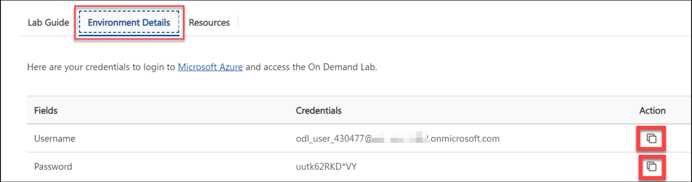
     
        
    
    1. Enter the admin password which should be provided by your lab hosting provider. Select **Sign in**.
    
        
     
    1. When prompted to protect the account, Please select **Skip for now**.

        
     
    1. When prompted to stay signed- in, select **Yes**. This takes you to the Microsoft 365 admin center page.

1. From the left navigation pane of the Microsoft 365 admin center, select **Show all**.

    

1. Under Admin centers, select **Compliance**.  A new browser page opens to the welcome page of the Microsoft 365 compliance center.  

    
    
    

1. From the left navigation panel of the Microsoft 365 compliance center, under Solutions, select **Information protection**.

1. In the yellow information box, indicates that Your organization has not turned on the ability to process content in Office online files that have encrypted sensitivity labels applied and are stored in OneDrive and SharePoint.  Select Turn on now.  Once you do this, there can be a delay for the setting to propagate through the system.

    

1. Verify you that the **Labels** tab on the top of the page is selected (underlined). Now select **Create a label**

    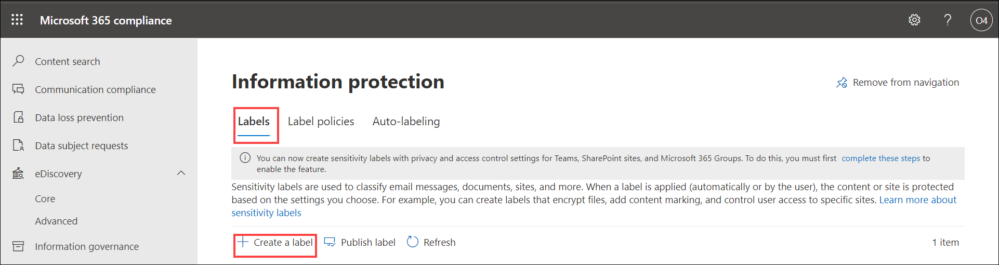

1. Configuration starts with providing a name and description for your label. Select **Next** at the bottom of the page.

    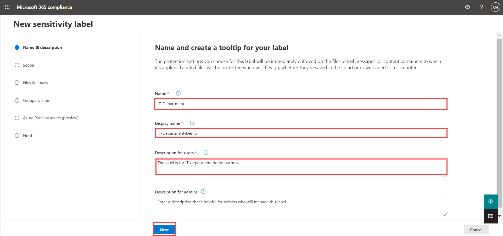

1. Note the scope for this label.  The scope is set to Files & emails to which you can configure Encryption and content marking settings to protect labeled emails and office files.  Don’t change anything.  Select **Next** at the bottom of the page.

    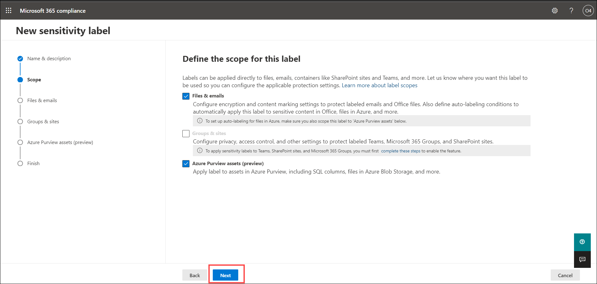

1. For the selected scope, Files & emails, you can configure to encrypt and/or mark the content.  Note how the protection settings for files and emails is set for both encryption and marking the content of files.  Review the definition of each.  Don’t change anything.  Select **Next** at the bottom of the page.

    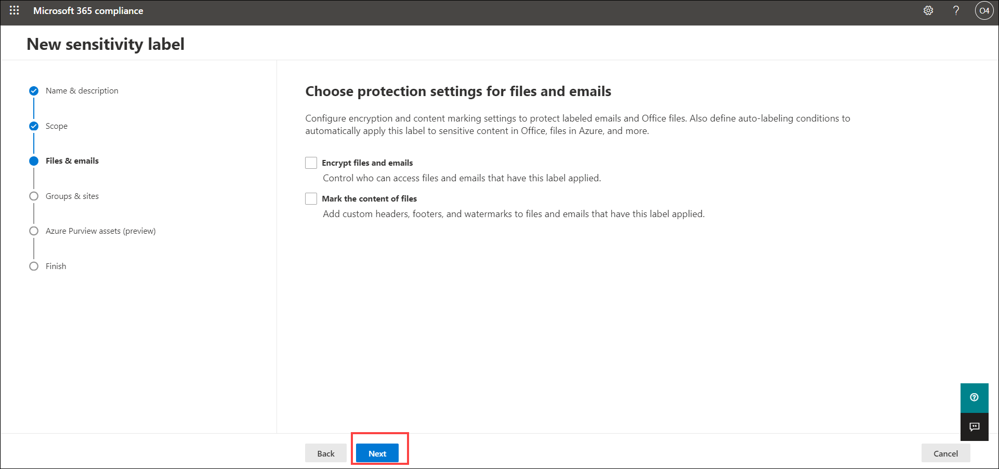

1. You are now in the Auto-labeling for files and emails window.  Read the description of auto-labeling on the top of the page and the information box below it.  Also take note that this label is set for auto-labeling for specific conditions. Don’t change any settings.  Select **Next** on the bottom of the page.

    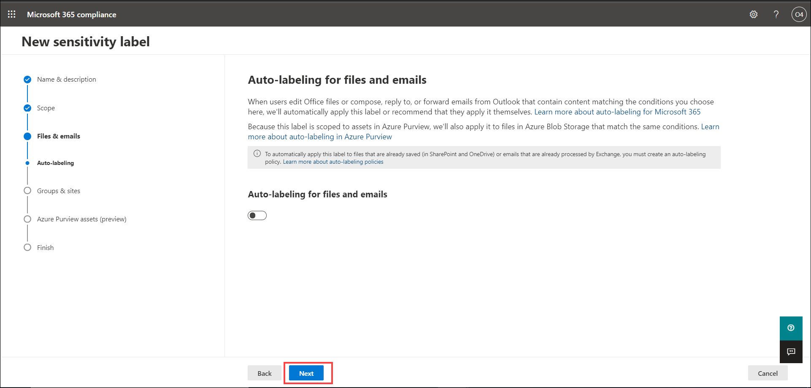

1. This next window defines protection settings for groups, and sites that have this label applied. This is not enabled, select **Next** on the bottom of the page.

    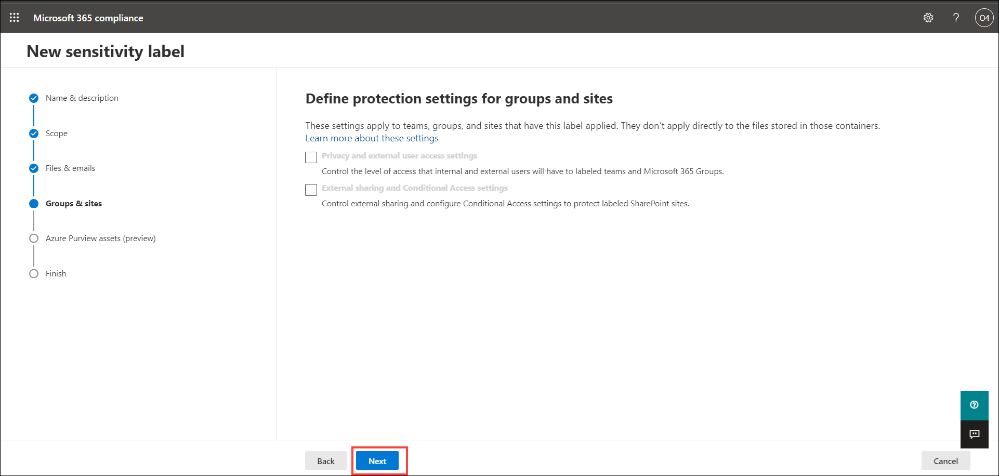

1. This next window is a preview feature to automatically apply this label to Azure database columns (such as SQL, Synapse, and more) that contain the sensitive info types you choose.  This features is not enabled. Select **Next** on the bottom of the page.

    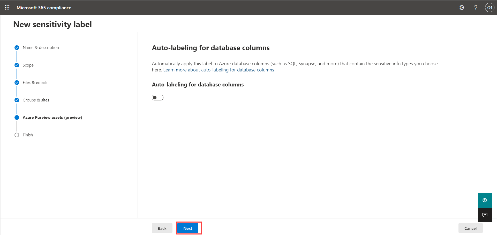
    
1.  Review the settings and click on **Create label**

    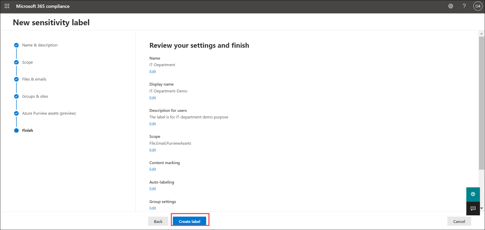

1. From the top of the Information protection page, select **Label policies**.  It is through label policies that sensitivity labels can be published.

    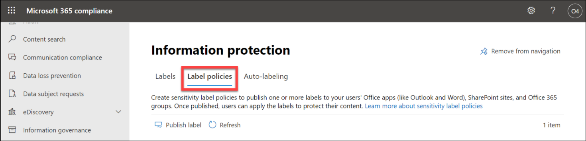
    
1. Select **Publish label**

    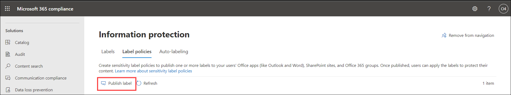
    
1. Select **Choose sensitivity labels to publish**. A window opens that provides information about the policy. This policy serves to publish the IT-Department-Demo. Select **IT-Department-Demo** from label and select **Add** on the bottom of the page. And then click on **Next**.

    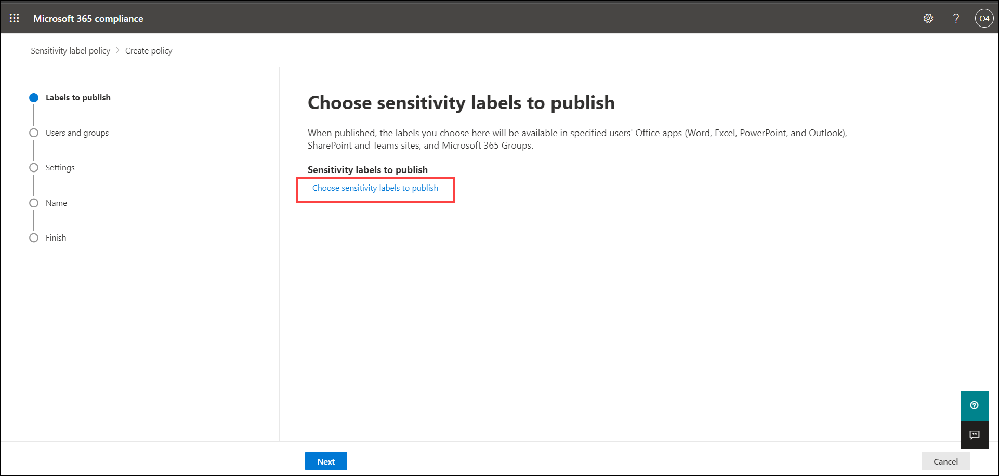
    
    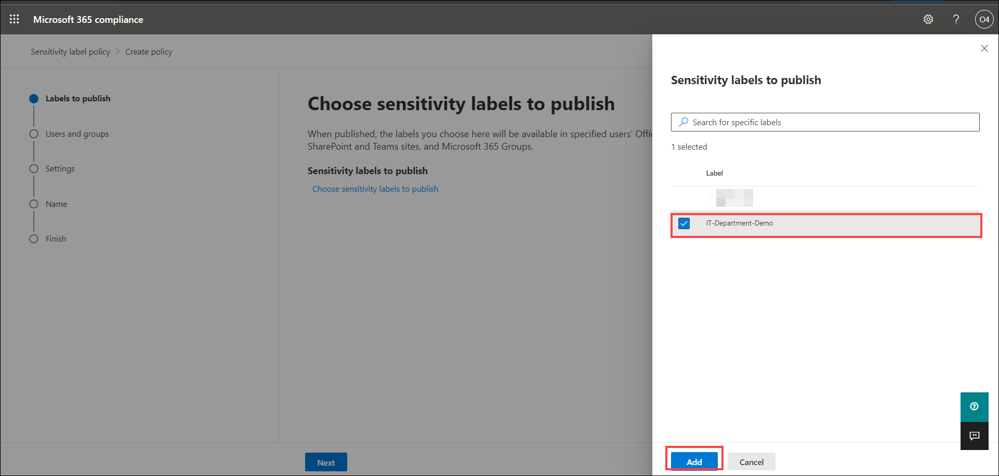

1. Read the description under “Publish to users and groups”.  Notice the this label is available to all users.  Don’t change any settings.  Select **Next** on the bottom of the page.

    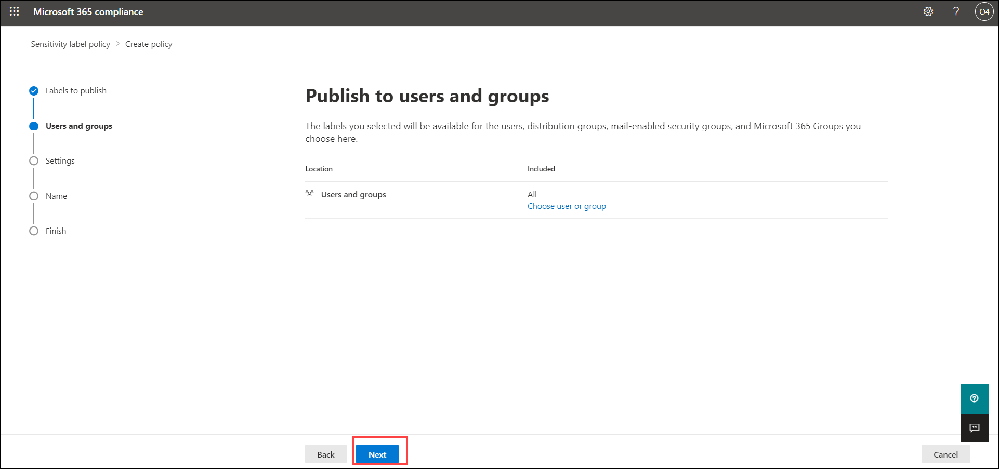

1. Under the policy settings.  Don’t change any settings.  Select **Next** on the bottom of the page.

    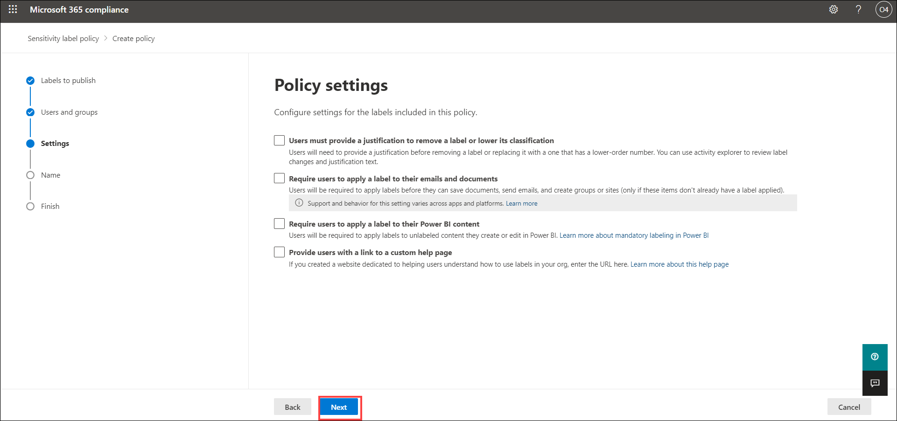

1. Under the **Apply a Default label to documents**.  Don’t change any settings.  Select **Next** on the bottom of the page.

    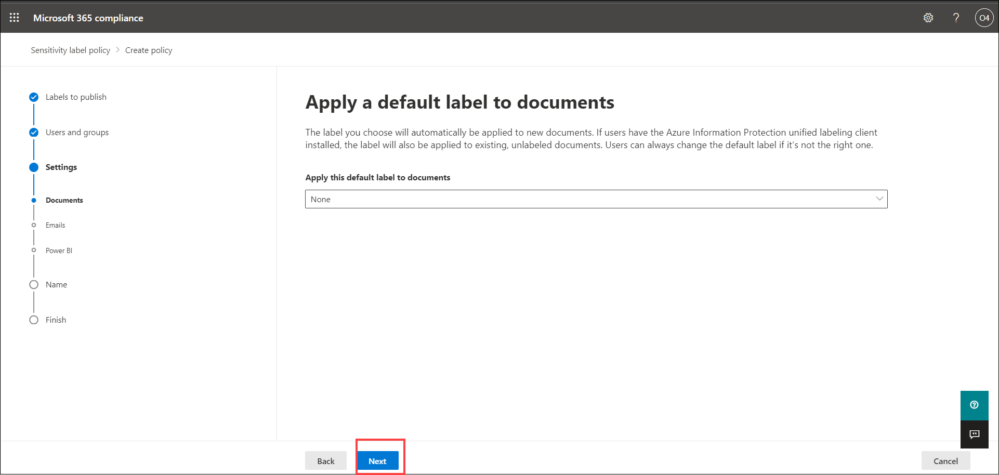

1. Under the **Apply a Default label to emails**.  Don’t change any settings.  Select **Next** on the bottom of the page.

    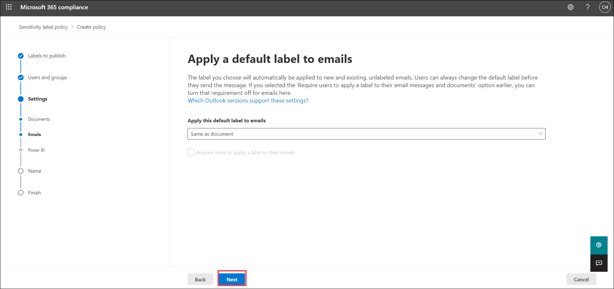

1. Under the **Apply a default label to Power BI content**.  Don’t change any settings.  Select **Next** on the bottom of the page.

    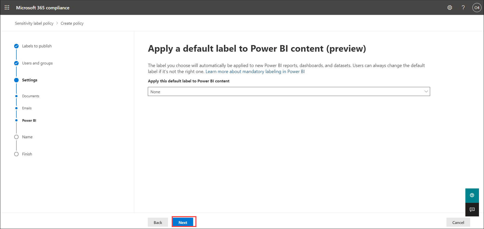

1. The last configuration option is to name your policy. Enter the policy name as **IT-Department-Policy**.  Select **Next** on the bottom of the page to exit the policy configuration and return to the Information protection page.

    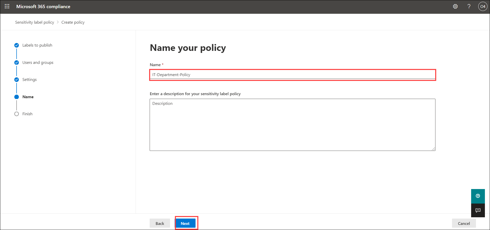
    
1. Review the settings and click on **Finish** and then select **Done**.

    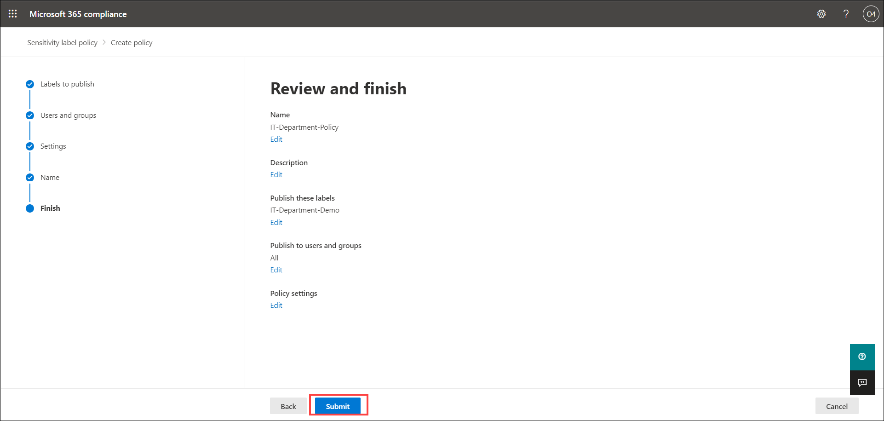
    
    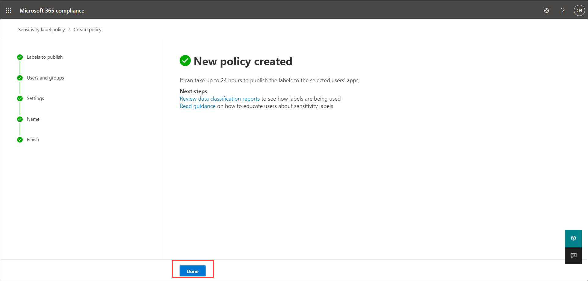    
    
**Note**- The label created cannot be deleted, it can only be edited. 

1. From the left navigation panel, select Home to return to the Microsoft 365 compliance center.

1. Keep this page open, you will use it in the next task.

#### Review
In this lab you will explore the capabilities of sensitivity labels.  You will create sensitivity labels and the corresponding policy to publish the label.
